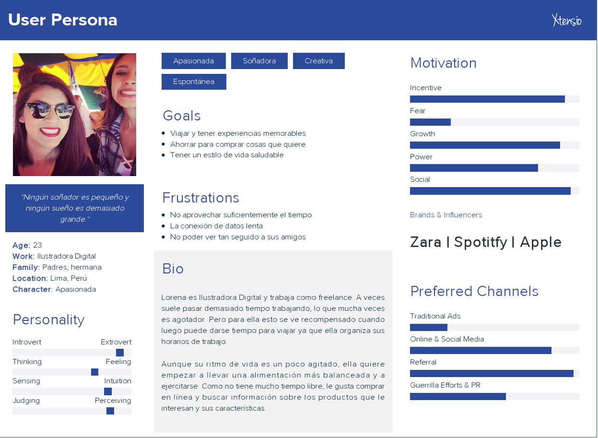

## PROBLEMA
Las páginas de tiendas no tienen la información de los productos y el stock actualizado.

## RETO
Realizar una página que tengas las dos siguientes vistas:
- Comprador:
Brindar un catálogo online que permite ver los precios, stock, fotos y detalle de los productos.
- Administrador:
Puede agregar editar, eliminar, actualizar productos 

**Público Objetivo**
- Millenials mujeres de 18 a 35 años

## Benchmarking
Realizamos un estudio de Benchmarking , nos ofrece un contexto de comparación inmediato con respecto a nuestros iguales (competidores directos e indirectos) permitiéndonos saber si estamos haciendo bien las cosas o si tenemos margen para mejorarlas y detectar oportunidades, amenazas así como debilidades y fortalezas que provienen de nuestro entorno de competidores.

## STAKEHOLDERS
- CEO
- Gerente de Marketing
- Director de proyecto
- Diseñador web
- Millenialls mujeres

## REUNIÓN KICK OFF
[**AGENDA DE ACTIVIDADES**](http://docs.google.com/document/d/1_vooE_yBEE2rj1v3dcruDtJjUTviaZnZblBrozv6L0I/edit)

### PREGUNTAS
**Cliente Interno**

## BUSINESS MODEL CANVAS

## PLAN DE INVESTIGACIÓN
### OBJETIVOS
- Comprender mejor qué información es relevante para los millennials.

- Conocer qué información motiva a los millennials a tomar decisiones financieras ¿Qué les importa a los millennials? ¿Qué los motiva?

- Conocer información  sobre las frustraciones  de los millennials , lo que los frustra no solo desde una perspectiva digital, sino también no digital. desde el momento en que el cliente entra al banco y habla con el personal, hasta la salida del establecimiento.Todos los detalles.La experiencia de usuario es todo. ¿Qué frustra a tus usuarios? ¿Qué necesidades tienen que no están siendo satisfechas?

- Conocer la interacción de los millennials con su entorno, tener una perspectiva holística nos dará una mejor idea del contexto del por qué toman ciertos caminos.

**HERRAMIENTAS**
- Benchmarking
- Encuestas
- Entrevistas a profundidad
- Diagrama de afinidad
- Testing

**ACTIVIDADES PLANEADAS**
## ETAPAS

### 1. Descubrimiento e investigación

- Formulación de cuestionario y guía de entrevistas
- [Encuestas online](https://docs.google.com/forms/d/e/1FAIpQLSdsot1wmRGD46ARa3YwvIAklEjfI7VOVnMYm07HAD3izOiCGA/viewform)
Se realizó encuestas que fueron enviadas a un público de alrededor 40 personas a través de internet, con la finalidad de darnos una idea de la situación actual, características de los usuarios, comportamientos financieros, preferencias, problemática, etc.
- Entrevistas a profundidad

### 2. Síntesis e Ideación
En esta etapa nos enfocamos en obtener los insights de los usuarios a través de la recopilación y análisis de información de nuestra investigación.

**DIAGRAMA DE AFINIDAD**

Se realizó un diagrama de Afinidad con la finalidad de poder analizar los datos obtenidos de las encuestas y entrevistas y agruparlos de acuerdo a las similutes de las respuestas. Los temas encontrados fueron :

*Información General*

- Utilizan tarjetas de crédito o débito
- Realizan transacciones online
- Realizan transacciones a través de la banca digital y app de su banco

*Beneficios más frecuentes al realizar transacciones Online*

- Ahorro de Tiempo
- Fácil
- Rapidez
- Comodidad

*Problemas más frecuentes con su banco*

- Cobro por transacciones
- La atención en ventanilla
- Cobro de mantenimiento

*Transacciones más frecuentes que realiza*

- Tranferencias
- Pago de servicios
- Pago de tarjetas

*Principales motivos por los que ahorra*

- Vivienda
- Estudios
- Viajes
- Imprevistos

*Principales características llamativas para los usuarios*

- Promociones
- Descuentos
- Consejos de ahorro

**CONCEPTUALIZACIÓN**

En base a la información recabada decidimos enfocarnos en los siguientes beneficios para los usuarios:
- Operaciones frecuentes
- Uso de cuentas de diferentes bancos
- Pago de servicios
- Consejos de ahorro
- Promociones

**USER PERSONA**

### 3. Prototipado y Testing
**PAPER PROTOTYPING**

Los primeros testing los realizamos en papel y el feedback que obtuvimos fue el siguiente:
- No entendían el término organizador, designado para ser un tracker de gastos. Pensaron que era como una agenda.
- Querían compartir la constancia de sus transacciones no solo por correo, sino por Whatsapp y otras aplicaciones.
- Sugirieron una sección de atención al cliente, en caso de inconvenientes en sus operaciones.
- Confusión en cuanto al método de registro.
- Les pareció amigable y sencillo.
- Querían una sección para encontrar sus operaciones más frecuentes/favoritas.
- Confusión al momento de seleccionar el banco con el que realizar sus operaciones.

**ALTA FIFELIDAD**
- Le gustaron los colores
- Faltó aliación entre las secciones
- Falto una sección de movimientos detallados de la cuenta.

**MARVEL**

- Transacciones: https://marvelapp.com/2e96496/screen/39518702
- Pago de servicios: https://marvelapp.com/2e96496/screen/39518693

### Miembros
- Nataly Cortez
- Ruth Matos
